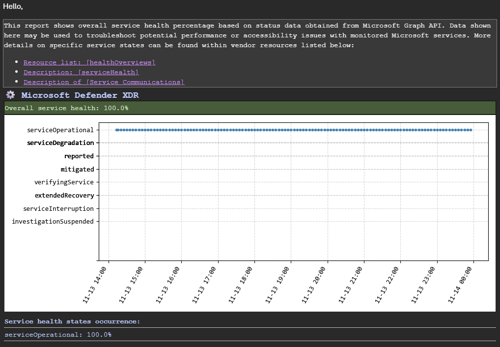

# 📃 Microsoft Service health API monitoring script

[](https://opensource.org/licenses/Apache-2.0)

## 💫 Updates
2025-11-14 - initial version of the script and documentation

## ⚙️ Main functionalities
Script enables service health monitoring and reporting capabilities by using Microsoft Graph API resources
published by vendor in order to:
- scan ``serviceHealth`` resource for current services status,
- cache configured services data locally in ``SQLite`` database,
- use cached data to produce overall service health report delivered via ``SMTP``,
- perform outdated data cleanup in order to limit database file size.

Script is designed to be run via task scheduler. Execution interval may be freely configured according to monitoring
needs / specifications.

## ➕ Dependencies
Script works with ``https://`` requests to REST API, producing health state charts for reports. Several libraries
need to be installed in order for the script to operate:

``pip install requests matplotlib msal``

**IMPORTANT:** please ensure that MS Azure app registration has ``serviceHealth`` permission from GRAPH API assigned. 
This app should also be configured for ``automation`` use enabling programmatic access for Auth token retrieval.

Script produces several outputs:
- service health charts,
- script logs,
- script database.
Configured path should be validated under permissions scope to write in.

## 🌐 External resources
Script utilizes connection with Microsoft Graph REST API through ``https://`` - ensure network traffic is not blocked.

## 🏃‍♂️‍➡️ Running script
Script operates on two modes which may be reflected in startup args configuration:
- to run API service health status collection: 
  - ``main.py --mode scan``,
- to run report (depending on a customer choices):
  - ``main.py --mode report --customer all``,
  - ``main.py --mode report --customer customername``.
When running report task for all configured customers, emails will be sent per customer.

## 📝 Configuration options
General config file is available as ``config.py``. It stores default settings, which could be configured.

### Directories
- ``DIR_MAIN`` main script outputs directory,
- ``DIR_LOGS`` script logs subdirectory,
- ``DIR DB`` script local SQLite database directory,
- ``DIR_IMAGES`` script service health charts output directory,

### API endpoints
- ``API_ENDPOINT_HEALTH`` main endpoint containing service health info,
- ``API_ENDPOINT_ANNOUNCE`` endpoint containing FYI details related to services and their states,
- ``API_ENDPOINT_AUTH`` authentication framework endpoint for Auth tokens,
- ``API_ENDPOINT_SCOPE`` endpoint scope for Auth process.

### Identified service statuses
- ``STATUS_MAP`` service health map sorted by impact priority: operational states configured as 9 & 10, others as lower 
values. This is used to calculate overall service health based on different possible scenarios and real impact on 
service availability.

### Monitored customers
- ``CUSTOMERS``: dictionary containing configured customers data
```python
{
    'customer1': {
        'variable': 'API_CHECK_CUSTOMER1',
        'services': ['Intune', 'Microsoft365Defender'],
        'mail_to': 'recipient@domain.com',
        'mail_cc': ''
    }
}
```
Field descriptions:
- ``variable``: name of ``environmental variable`` in which API credentials are stored. Variable value - credentials 
delimited as follows: ``azure_tenant_id;client_id;secret_value``,
- ``services``: names of services chosen for monitoring according to MS Graph API notation,
- ``mail_to``: service health report ``TO`` recipient(s),
- ``mail_cc``: service health report ``CC`` recipient(s).

**IMPORTANT:** customer names should be provided in a way enabling them to be easily identified.
**IMPORTANT:** script uses API credentials stored in env variables by default according to security principles.

### Database
- ``DB_DAYS_SCOPE`` customizable data retention limit for old records deletion,
- ``DB_DAYS_PREV_FROM`` report scope: days ago limit,
- ``DB_DAYS_PREV_TO`` report scope: days to limit.

For a report from a previous day both variables should be set to ``1``. Timestamp formats as follows:
- ``DB_DAYS_PREV_FROM``: YYYY-MM-DD 00:00:00,
- ``DB_DAYS_PREV_TO``: YYYY-MM-DD 23:59:59.

### SMTP and email messages
- ``SMTP_SERVER``: address of a server,
- ``SMTP_PORT``: SMTP server port,
- ``MAIL_FROM``: report sender display name / address,
- ``MAIL_SUBJECT``: email message subject pattern,
- ``MAIL_SIGNATURE``: custom email signature ``*.html`` string.

## 📃 Report output
Report contains separate sections per monitored service. Each section contains info about:
- overall service health based on a service state map,
- service health chart showing status changes over time,
- per-service status occurrence list for a reported period.

Sample:



## 📜 License

Project is available under terms of **[Apache License 2.0](http://www.apache.org/licenses/LICENSE-2.0)**.  
Full license text can be found in file: [LICENSE](./LICENSE).

---

© 2025 **Vismaanen** — simple coding for simple life